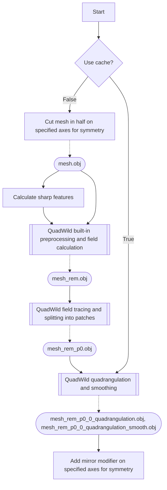

# QRemeshify
{ [Download](https://ksami.gumroad.com/l/QRemeshify) | [Forums](https://github.com/ksami/QRemeshify/discussions) | [Issues](https://github.com/ksami/QRemeshify/issues) }

A Blender extension for an easy-to-use remesher that outputs good-quality quad topology

Based on [QuadWild with Bi-MDF solver](https://github.com/cgg-bern/quadwild-bimdf) which is based on [QuadWild](https://github.com/nicopietroni/quadwild)

# Features
- Good-quality quad topology even with basic usage
- Supports symmetry
- Guide edge flow with edges marked seams/sharp/material boundary/face set boundary
- Options for advanced fine-tuning available
- No external programs to download or run

# Example
[Suzanne 3D Model](/example/suzanne-quadwild-bimdf.stl)  

Model from Elizaveta  

Model from Wildreamz  

## Try it

1. *Add > Mesh > Monkey*
2. Add subdivision modifier with 2 levels
3. Add triangulate modifier
4. Open QRemeshify panel, disable Preprocess, set sharp angle threshold to 25, enable symmetry in X-axis

# Requirements
- Blender 4.2 and above
- Windows (still testing Linux and macOS)

# Installation
1. Download the zip file according to your OS from [Gumroad](https://ksami.gumroad.com/l/QRemeshify) or from [Releases](https://github.com/ksami/QRemeshify/releases)
2. For Blender 4.2 and above, go to *Edit > Preferences > Addons* and click the arrow pointing down on the top right
3. Click on *Install from Disk...* and select the downloaded zip file
4. Ensure the checkbox is ticked to enable QRemeshify

# Usage
QRemeshify can be accessed from the 3D view N-Panel (Press `N` in 3D view) while in Object mode

Please remember to save often, time taken for remeshing is dependent on many factors and may take an unexpectedly long time

# Settings
| Option | Description | Performance Impact |
| --- | --- | --- |
| Preprocess | Runs QuadWild's built-in decimation, triangulation, and attempt to fix common geometry issues | High |
| Smoothing | Smooths topology after quadrangulation | High |
| Detect Sharp | Generates sharp features from edges above the threshold, from edges marked sharp, and edges marked seam | Low |
| Symmetry | Produce symmetrical topology along specified axes | Shortens time taken since less geometry is processed |

## Advanced Settings
| Option | Description | Performance Impact |
| --- | --- | --- |
| Debug Mode | Shows meshes produced by intermediate steps | Low |
| Use Cache | Run pipeline from quadrangulation step onwards (see [Pipeline](#pipeline)) (__MUST__ run full pipeline once before) | Shortens time taken since less steps run |

Other than `Debug Mode` and `Use Cache`, advanced settings are passed straight through to the underlying [QuadWild Bi-MDF](https://github.com/cgg-bern/quadwild-bimdf) and [QuadWild](https://github.com/nicopietroni/quadwild) library and are either undocumented or too complex for me to understand. They are still made available here for experimentation and fine-tuning.

# Tips
Find and share more tips at [Discussions](https://github.com/ksami/QRemeshify/discussions/categories/tips-and-tricks)
- Slower for more complex shapes eg. lots of cloth folds, try separating into smaller, simpler parts
- Having an even distribution of tris seems faster, either manually decimate and triangulate or enable Preprocess to help with this
- Time taken is proportional to number of faces, decimate to <100k tris would be a good start
- Needs sufficient geometry to work with to get a good topology, roughly >1k tris
- Loose geometry may need to be separated into individual objects, *Edit mode > P > Separate by loose*
- Use edges marked as sharp or UV seams to influence edge flow
- Use cache to only run quadrangulate step if previous steps have been run once before, for speeding up while tweaking advanced settings

# Pipeline

